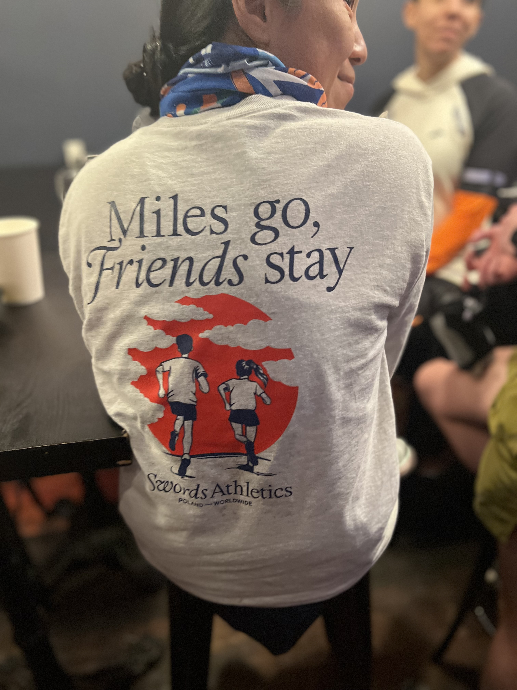

  
  

I've been lucky to have people in my corner who gave me time and honest conversation when I needed it. This is my version of paying that forward.
Run-on-Run is a simple offer: come run 3–4 miles with me in NYC, and let's actually talk.

I'm opening up a few spots for women in product, engineering, and design — early, mid, or senior career. Conversational pace (~9:30–10:00/mile), daylight routes, bridges or parks, safety first.

We'll talk about work, career moves, ideas, and pivots. I'll bring curious questions and a coaching mindset. You bring yourself.

Interested? DM me on [LinkedIn](https://www.linkedin.com/in/jacquelineyue/).

